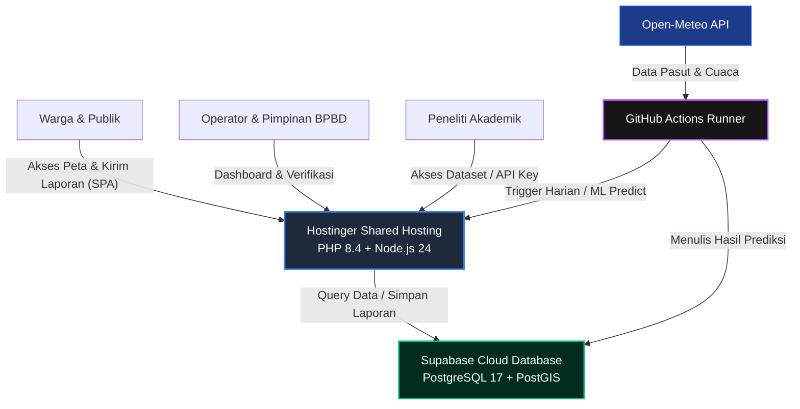
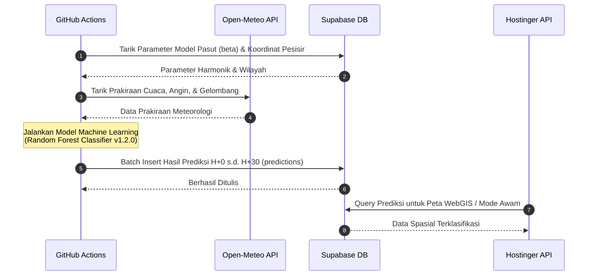

# 🌊 SIPERAH-RoB
> **Sistem Informasi Prediksi Risiko Banjir Rob Terpadu Provinsi Lampung**

[](file:///c:/laragon/www/Siperah-ROB/README.md)
[](https://laravel.com)
[](https://react.dev)
[](https://python.org)
[](https://postgresql.org)
[](https://postgis.net)

SIPERAH-RoB adalah **Sistem Informasi Geografis (SIG)** berbasis WebGIS terpadu yang memanfaatkan kecerdasan buatan (*Machine Learning*) untuk memproyeksikan, memantau, dan memitigasi bencana banjir rob (genangan pasang air laut) secara *real-time* di wilayah pesisir Provinsi Lampung.

---

## 🛠️ Stack Teknologi (Tech Stack)

| Lapisan (Layer) | Teknologi Utama | Deskripsi Peran |
| :--- | :--- | :--- |
| **Frontend** | React 18, TypeScript, MapLibre GL JS, CSS Vanilla | Aplikasi SPA responsif dengan visualisasi peta interaktif berkinerja tinggi. |
| **Backend** | Laravel 11, PHP 8.4, Sanctum, Database Queue | REST API terpusat, pengelola otorisasi (RBAC), audit logs, dan cron worker. |
| **Database** | Supabase (PostgreSQL 17), PostGIS Extension | Penyimpan data spasial wilayah pesisir dan koordinat laporan warga. |
| **ML Engine** | Python 3.11, scikit-learn, Pandas, imbalanced-learn | Pipeline data cuaca ERA5, model Random Forest Classifier, dan balancing SMOTE. |
| **CI/CD & Jobs** | GitHub Actions, hPanel Cron Scheduler | Otomasi deployment, uji integrasi (CI), dan Retraining/Prediction ML harian. |

---

## 1. Arsitektur Sistem (Production Architecture)

Aplikasi dideploy dengan topologi hemat biaya (*cost-effective*) dan redundansi tinggi menggunakan kombinasi cloud resources:



---

## 2. Alur Proses Prediksi & Data Flow

Prakiraan risiko bencana rob diperbarui setiap hari melalui tahapan *pipeline* otomatis berikut:



---

## 3. Peta Portal Dokumentasi Lengkap (Documentation Hub)

Seluruh modul dan dokumentasi resmi tugas akhir dikompilasi secara rapi di dalam portal ini:

```carousel
| Berkas Utama | Kode Blok | Deskripsi Utama |
| :--- | :---: | :--- |
| 📖 [Panduan Deployment Produksi](file:///c:/laragon/www/Siperah-ROB/docs/deployment_guide.md) | `D1` | Prosedur deploy Hostinger + Supabase + cron worker. |
| 📋 [Matriks Ketertelusuran SKPL](file:///c:/laragon/www/Siperah-ROB/docs/SKPL_traceability_matrix.md) | `D2` | Pemetaan Kebutuhan FR ke UI, API, dan berkas pengujian. |
| 🔌 [Kontrak & Referensi API Peneliti](file:///c:/laragon/www/Siperah-ROB/docs/api-contract.md) | `D3` | API key, rate limit, dan endpoint penelitian v1. |
| 🗄️ [Diagram Skema Database (ERD)](file:///c:/laragon/www/Siperah-ROB/docs/erd_diagram.md) | `D4` | Diagram relasi entitas PostgreSQL/PostGIS. |
<!-- slide -->
| Berkas Panduan & Hasil | Kode Blok | Deskripsi Utama |
| :--- | :---: | :--- |
| 👤 [Panduan Pengguna per Peran](file:///c:/laragon/www/Siperah-ROB/docs/user_guide.md) | `D5` | Cara pakai aplikasi untuk Warga, Operator, dan Provinsi. |
| ⚙️ [Runbook Operasional & Insiden](file:///c:/laragon/www/Siperah-ROB/docs/admin_runbook.md) | `D6` | Langkah taktis jika API down, DB down, dan prosedur backup. |
| 🧪 [Laporan Pengujian UAT](file:///c:/laragon/www/Siperah-ROB/docs/uat_results.md) | `D7` | Hasil pengujian skenario E2E Playwright. |
| 📝 [Standardisasi Copywriting & Istilah](file:///c:/laragon/www/Siperah-ROB/docs/copywriting_review.md) | `D8` | Penyeragaman glosarium status dan level risiko UI. |
```

---

## 4. Fitur Utama Sistem

* **🗺️ Visualisasi WebGIS Interaktif**: Zonasi bahaya rob 4 kelas per kelurahan dengan clustering titik laporan berbasis MapLibre GL.
* **📱 Mode Awam (Geolocated EWS)**: Deteksi titik koordinat otomatis menggunakan sensor GPS perangkat pengguna untuk menyajikan ringkasan risiko non-teknis secara instan.
* **📸 Pelaporan Ground Truth Warga**: Pengiriman laporan kejadian banjir rob terintegrasi dengan penentuan koordinat peta dan kompresi WebP gambar otomatis di sisi klien.
* **🔔 Notifikasi Multi-Kanal dengan Quiet Hours**: Pengiriman alert via Email dan Push Browser dengan opsi penahanan pengiriman di jam sunyi personal.
* **🛡️ Audit Logs Transparansi**: Pencatatan riwayat transaksi sensitif untuk keperluan audit (otorisasi, ekspor data, validasi operator).

---

## 5. Panduan Memulai Cepat (Quick Start)

### A. Prasyarat Sistem
* Node.js >= 20
* PHP >= 8.4 (ekstensi `pdo_pgsql`, `pgsql` wajib aktif)
* PostgreSQL dengan ekstensi **PostGIS** terpasang.

### B. Menjalankan Backend (Laravel API)
1. Pindah ke direktori backend:
   ```bash
   cd backend
   composer install
   ```
2. Salin `.env.example` ke `.env` dan masukkan kredensial database Supabase/PostgreSQL Anda.
3. Jalankan migrasi database:
   ```bash
   php artisan migrate --seed
   ```
4. Jalankan server lokal:
   ```bash
   php artisan serve
   ```

### C. Menjalankan Frontend (React + Vite)
1. Pindah ke direktori frontend:
   ```bash
   cd ../frontend
   npm ci
   npm run dev
   ```
2. Buka browser pada alamat `http://localhost:5173`.
