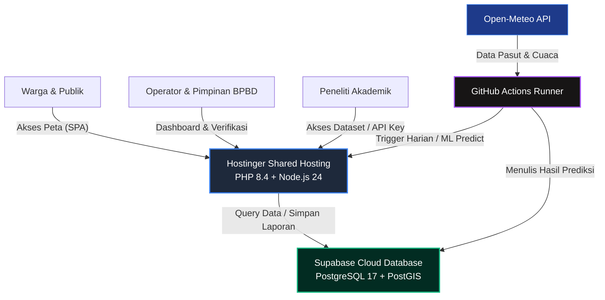
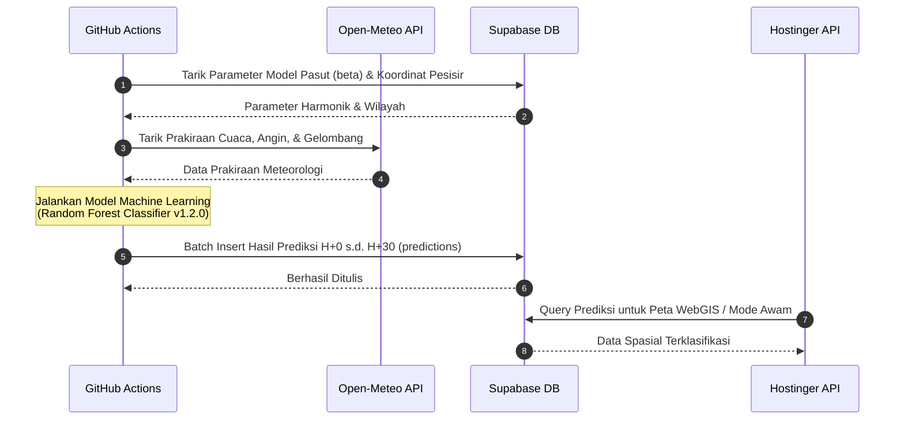

# 🌊 SIPERAH-RoB
> **Sistem Informasi Prediksi Risiko Banjir Rob Terpadu Provinsi Lampung**

Sistem Informasi Geografis (SIG) berbasis WebGIS yang memanfaatkan kecerdasan buatan (*Machine Learning*) untuk memproyeksikan, memantau, dan memitigasi bencana banjir rob (genangan pasang laut) di sepanjang pesisir Provinsi Lampung secara *real-time*.

---

## 1. Arsitektur Sistem (Production Architecture)

Aplikasi dideploy menggunakan arsitektur modern, efisien, dan hemat biaya (*cost-effective*):



---

## 2. Alur Proses Prediksi & Data Flow

Setiap hari secara otomatis, data astronomis (pasang surut) dan meteorologi (cuaca & gelombang) ditarik untuk melakukan pemodelan inferensi:



---

## 3. Peta Portal Dokumentasi Lengkap (Documentation Hub)

Seluruh berkas dokumentasi resmi proyek dan tugas akhir dikompilasi secara lengkap di bawah ini:

| Berkas Dokumentasi | Kode Blok | Deskripsi & Isi Dokumen |
| :--- | :--- | :--- |
| 📖 [Panduan Deployment Produksi](file:///c:/laragon/www/Siperah-ROB/docs/deployment_guide.md) | `D1` | Panduan langkah deploy Hostinger Shared + Supabase, Cron, Queue, dan rencana rollback. |
| 📋 [Matriks Ketertelusuran SKPL](file:///c:/laragon/www/Siperah-ROB/docs/SKPL_traceability_matrix.md) | `D2` | Matriks ketertelusuran spesifikasi kebutuhan fungsional (FR) s.d. endpoint, UI, dan berkas pengujian. |
| 🔌 [Kontrak & Referensi API Peneliti](file:///c:/laragon/www/Siperah-ROB/docs/api-contract.md) | `D3` | Dokumen API Reference v1 lengkap dengan query params, scopes, dan contoh response JSON. |
| 🗄️ [Diagram Skema Database (ERD)](file:///c:/laragon/www/Siperah-ROB/docs/erd_diagram.md) | `D4` | Model diagram relasi entitas (*Entity-Relationship Diagram*) lengkap dalam format Mermaid. |
| 👤 [Panduan Pengguna per Peran](file:///c:/laragon/www/Siperah-ROB/docs/user_guide.md) | `D5` | Panduan praktis operasional sistem untuk Warga, Operator BPBD, BPBD Provinsi, Peneliti, dan Admin. |
| ⚙️ [Runbook Operasional & Insiden](file:///c:/laragon/www/Siperah-ROB/docs/admin_runbook.md) | `D6` | Prosedur taktis admin untuk mengatasi API down, DB down, kegagalan sinkronisasi, dan panduan backup. |
| 🧪 [Laporan Pengujian UAT](file:///c:/laragon/www/Siperah-ROB/docs/uat_results.md) | `D7` | Skenario pengujian fungsional dan penerimaan pengguna (UAT) per peran pengguna. |
| 📝 [Standardisasi Copywriting & Istilah](file:///c:/laragon/www/Siperah-ROB/docs/copywriting_review.md) | `D8` | Penyeragaman glosarium kata kunci di antarmuka sistem (status laporan, severity, risk class). |
| 🗺️ [Skema SQL Awal Database](file:///c:/laragon/www/Siperah-ROB/database/schema.sql) | `DB` | DDL sql awal untuk struktur tabel produksi postgres + postgis. |

---

## 4. Panduan Memulai Cepat (Quick Start)

### A. Prasyarat Sistem
* Node.js >= 20
* PHP >= 8.4 (ekstensi `pdo_pgsql`, `pgsql` aktif)
* PostgreSQL dengan ekstensi **PostGIS** aktif.

### B. Menjalankan Backend (Laravel API)
1. Pindah ke direktori backend:
   ```bash
   cd backend
   composer install
   ```
2. Buat file `.env` dari `.env.example`, sesuaikan kredensial database PostgreSQL Anda.
3. Jalankan migrasi dan seeder database:
   ```bash
   php artisan migrate --seed
   ```
4. Jalankan server lokal:
   ```bash
   php artisan serve
   ```

### C. Menjalankan Frontend (React + Vite)
1. Pindah ke direktori frontend:
   ```bash
   cd ../frontend
   npm ci
   ```
2. Jalankan server pembangunan lokal:
   ```bash
   npm run dev
   ```
3. Buka browser pada alamat `http://localhost:5173`.

---

## 5. Fitur Utama Sistem
* **Peta Interaktif WebGIS**: Zonasi risiko banjir rob 4 level dengan visualisasi map layer dinamis (MapLibre GL JS).
* **Mode Awam Geospasial**: Informasi risiko banjir rob instan berbasis lokasi GPS/pencarian warga.
* **Crowdsourced Ground Truth**: Pengiriman laporan genangan rob secara *mobile-first* lengkap dengan kompresi WebP gambar di sisi klien.
* **Audit Log Komprehensif**: Pencatatan riwayat transaksi sensitif untuk transparansi operasional sistem.
* **Notifikasi Multi-Kanal**: Dukungan notifikasi in-app, push browser, dan email dengan konfigurasi jam sunyi (*quiet hours*).
* **Researcher Portal**: Unduhan dataset historis (CSV/JSON) dan manajemen otorisasi API key peneliti.
