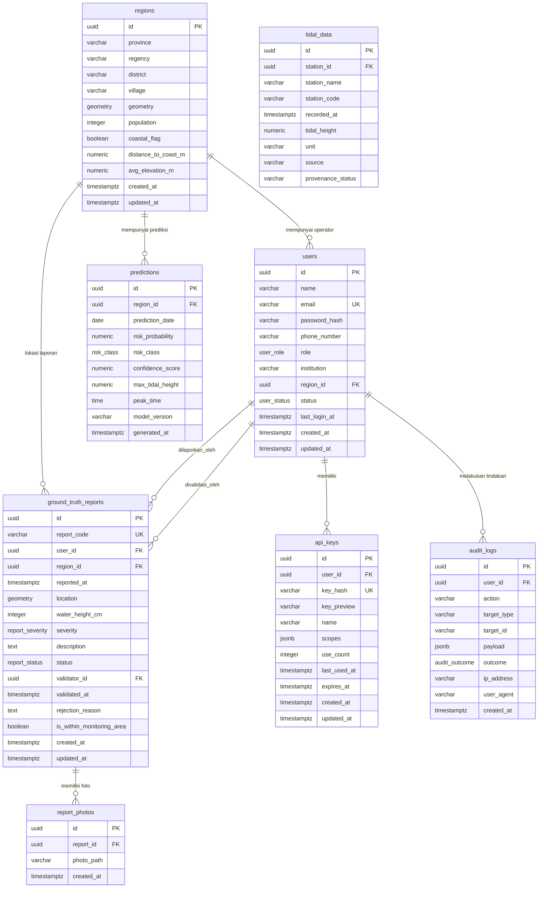

# Entity-Relationship Diagram (ERD) - SIPERAH-RoB

Dokumen ini mendokumentasikan skema database relasional **SIPERAH-RoB** menggunakan diagram Mermaid.

---

## 1. Diagram ERD (Mermaid Format)

---

## 2. Deskripsi Hubungan Utama
1. **Hubungan Wilayah & Pengguna (`regions` -> `users`)**: Relasi satu-ke-banyak (*one-to-many*) opsional. Digunakan untuk membatasi wilayah kerja operator BPBD kabupaten/kota (`region_id`).
2. **Hubungan Wilayah & Prediksi (`regions` -> `predictions`)**: Relasi satu-ke-banyak (*one-to-many*) wajib. Setiap kelurahan pesisir memiliki baris prediksi harian yang dihitung oleh pipeline Machine Learning untuk 30 hari ke depan.
3. **Hubungan Laporan Ground Truth (`ground_truth_reports`)**: 
   * Terikat ke `users` sebagai pelapor.
   * Terikat ke `regions` sebagai kelurahan terasosiasi (ditentukan secara otomatis secara spasial melalui `ST_Contains` koordinat geospasial).
   * Terikat kembali ke `users` (sebagai `validator_id`) saat operator melakukan verifikasi.
4. **Foto Laporan (`report_photos`)**: Menyimpan berkas bukti fisik kejadian rob (WebP terkompresi) yang terikat langsung ke laporan.
